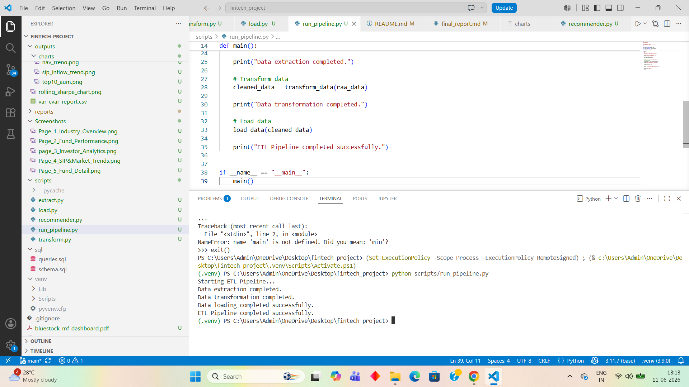
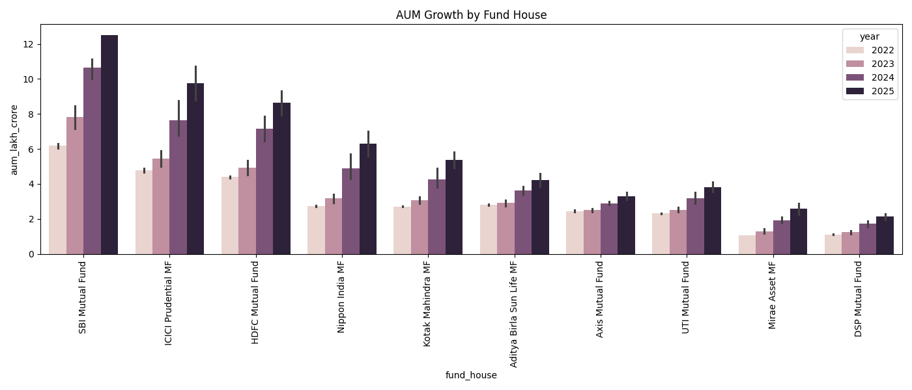
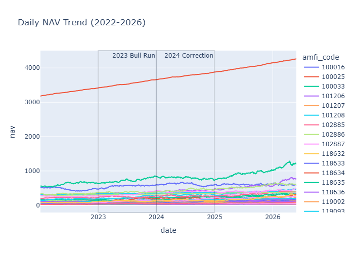
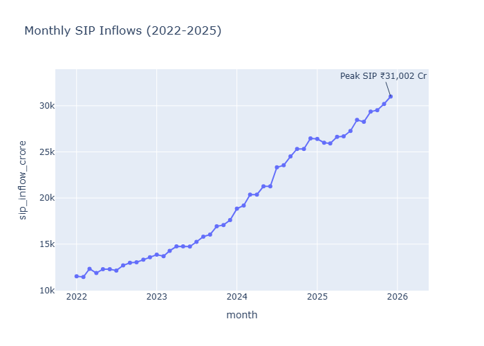
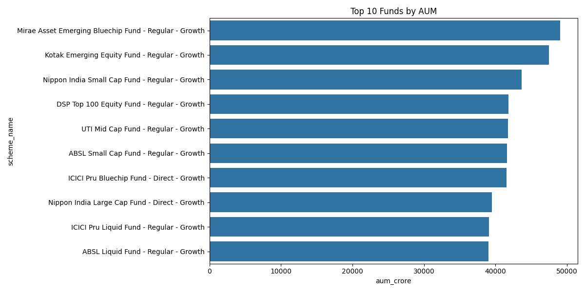
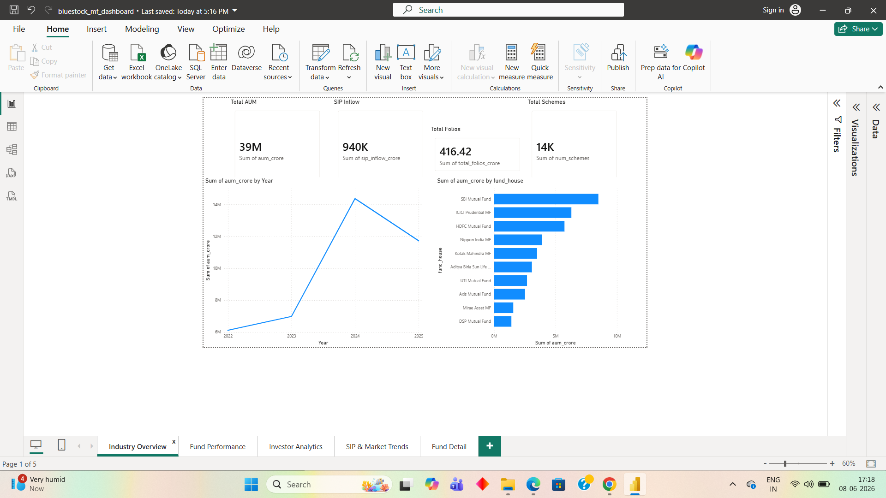
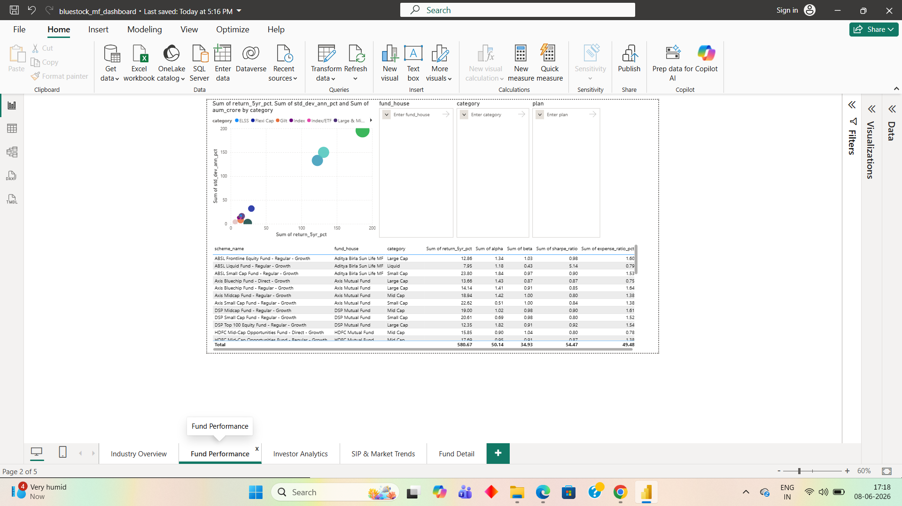
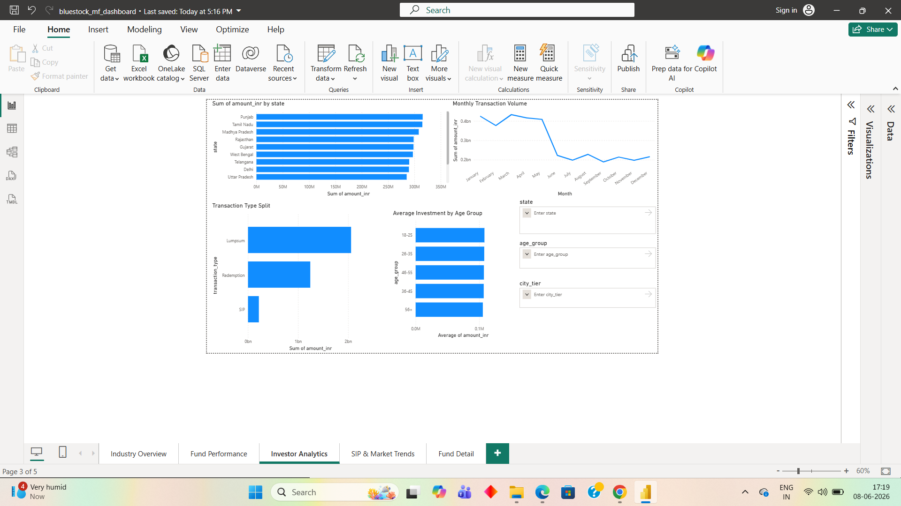
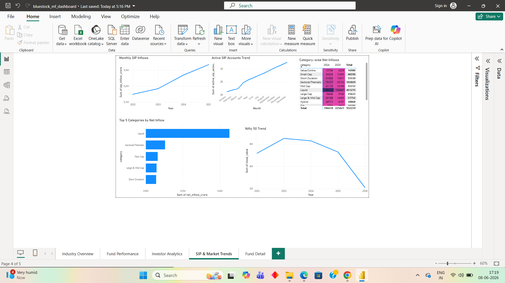
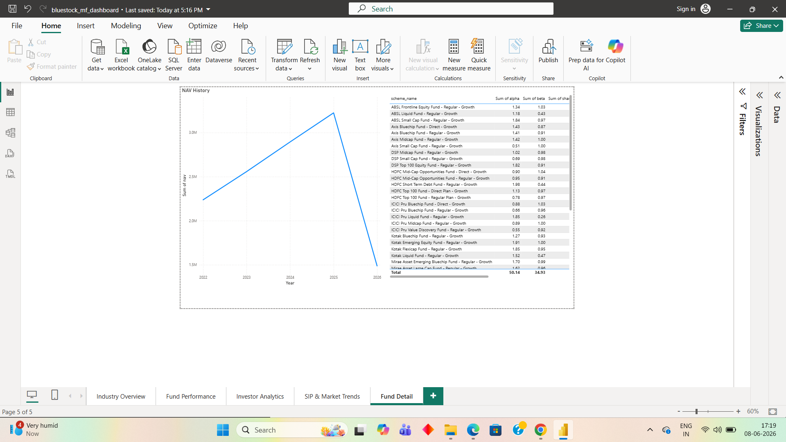

# Bluestock Mutual Fund Analytics Capstone

## Final Project Report

Prepared By:
Shobhitha H R

Technology Stack:
Python | SQL | Power BI | Data Analytics

Date:11 June 2026

# 1. Executive Summary

The Bluestock Mutual Fund Analytics Capstone project focuses on analyzing Indian mutual fund data to understand investment trends, fund performance, asset growth, and investor behavior.

The project implements an end-to-end analytics workflow including data extraction, data cleaning, exploratory data analysis, performance analysis, and interactive dashboard development.

A Python-based ETL pipeline was developed to automate data preparation. The processed datasets were analyzed using Python and visualized through Power BI dashboards.

The project provides insights into:
- Assets Under Management (AUM) growth
- NAV trends
- SIP investment patterns
- Fund performance comparison
- Category-wise investment behavior

# 2. Problem Statement

Mutual fund data is available across multiple datasets, making it difficult to analyze investment trends and compare fund performance.

The objective of this project is to build an analytics solution that combines multiple datasets and provides meaningful insights through dashboards.

# 3. Project Objectives

The main objectives are:

- Analyze mutual fund scheme performance
- Understand AUM growth patterns
- Study SIP inflow trends
- Compare fund categories
- Identify top-performing funds
- Build an automated ETL pipeline
- Create interactive Power BI dashboards

# 4. Data Sources

The project uses multiple mutual fund datasets to perform comprehensive analysis.

| Dataset | Description |
|---|---|
| Fund Master | Contains mutual fund scheme details such as scheme name, category, and fund house |
| NAV History | Contains historical Net Asset Value records |
| AUM Data | Provides Assets Under Management information |
| SIP Inflows | Contains monthly SIP investment trends |
| Category Inflows | Represents investment flows across mutual fund categories |
| Folio Count | Provides investor participation information |
| Scheme Performance | Contains fund return and performance metrics |
| Investor Transactions | Contains transaction-level information |

These datasets were combined to create a complete view of mutual fund performance and investor behavior.

# 5. ETL Architecture

The project follows an automated ETL (Extract, Transform, Load) workflow.

## Extract

The extraction process reads mutual fund CSV datasets from the processed data directory.

## Transform

The transformation stage performs:

- Duplicate removal
- Column name standardization
- Missing value handling
- Data formatting
- Data preparation for analysis

## Load

The cleaned datasets are stored for further analysis and dashboard development.

## ETL Flow
Raw Dataset Files

    ↓

Extract (Python)

    ↓

Transform (Cleaning)

    ↓

Load (Processed Data)

    ↓

Analytics Dashboard

The pipeline is automated using:python scripts/run_pipeline.py

## ETL Pipeline Implementation

The ETL pipeline was implemented using modular Python scripts:

- extract.py → Reads raw datasets
- transform.py → Cleans and prepares data
- load.py → Stores processed outputs
- run_pipeline.py → Executes complete workflow

## System Architecture

The overall architecture of the project is:
Raw Mutual Fund Data

    ↓

Python ETL Pipeline

    ↓

Clean Processed Data

    ↓

EDA & Performance Analysis

    ↓

Power BI Dashboard

    ↓

Business Insights
# 6. Exploratory Data Analysis

EDA was performed to understand data distribution, trends, and relationships.

## AUM Analysis

The Assets Under Management analysis identifies growth patterns across mutual fund categories.

Key observations:

- Certain categories contribute significantly to total AUM.
- Large fund houses dominate the market share.
- AUM trends help understand investor confidence.

## NAV Trend Analysis

Historical NAV analysis was performed to study fund value movement over time.

Insights:

- NAV values show variation across schemes.
- Long-term trends help compare fund performance.

## SIP Inflow Analysis

SIP inflow analysis provides insights into investor participation.

Findings:

- SIP investments show increasing adoption.
- Regular investment patterns indicate long-term investor interest.

## 6.1 EDA Visualizations

## AUM Growth Analysis

The AUM growth analysis shows the change in Assets Under Management over time.

AUM is an important indicator of investor participation and overall mutual fund market growth.

---

## NAV Trend Analysis

The NAV trend analysis represents the historical movement of mutual fund Net Asset Value.

This helps understand fund value changes and long-term performance patterns.

---

## SIP Inflow Analysis

The SIP inflow analysis highlights monthly investment patterns.

The trend helps identify investor participation and systematic investment behavior.

---

## Top Funds by AUM

This analysis identifies mutual fund schemes with the highest Assets Under Management.

Higher AUM generally indicates greater investor trust and market presence.

# 7. Performance Analysis

Performance analysis was performed to evaluate mutual fund schemes based on returns, growth trends, and investment patterns.

## Fund Performance Evaluation

The analysis compares different mutual fund schemes using available performance metrics.

The evaluation focuses on:

- Historical returns
- NAV movement
- Fund category performance
- Assets Under Management (AUM)
- Investor participation

## Performance Insights

The analysis identified differences in performance across various mutual fund categories.

Key observations:

- Some categories demonstrate stronger growth potential.
- Large AUM funds show higher investor participation.
- Historical performance helps compare scheme effectiveness.

## Category Performance Analysis

Category-level analysis helps understand where investors are allocating capital.

It provides insights into:

- Equity fund growth
- Debt fund behavior
- Hybrid fund trends

## SIP Performance Analysis

SIP analysis evaluates systematic investment behavior.

Findings:

- SIP investments represent consistent investor participation.
- Monthly trends help identify investment patterns.
- Increasing SIP flows indicate growing awareness of mutual fund investments.

# 8. Dashboard Screenshots

The Power BI dashboard was developed to provide interactive insights into mutual fund performance, investor behavior, SIP trends, and fund-level analysis.

The dashboard consists of multiple pages covering different analytical views.

---

## Page 1: Industry Overview

This dashboard page provides a high-level overview of the mutual fund industry including major trends and summary metrics.

---

## Page 2: Fund Performance

This page focuses on comparing mutual fund performance and analyzing fund-level metrics.

---

## Page 3: Investor Analytics

This dashboard page analyzes investor-related patterns and participation trends.

---

## Page 4: SIP & Market Trends

This page highlights systematic investment plan trends and market movement insights.

---

## Page 5: Fund Details

This page provides detailed information about individual mutual fund schemes.

# 9. Limitations

Although the project provides meaningful insights into mutual fund analytics, there are certain limitations.

## Data Availability

The analysis depends on the datasets available for the project. Limited historical records may affect long-term trend analysis.

## External Market Factors

The project does not include external factors such as:

- Market volatility
- Economic conditions
- Interest rate changes
- Government policy changes

## Real-Time Data

The dashboard uses static datasets and does not currently support live market updates.

## Predictive Analysis

The current project focuses on descriptive and diagnostic analytics. Future versions can include predictive models for forecasting fund performance.

# 10. Recommendations

Based on the analysis performed, the following recommendations can improve the solution:

## Real-Time Data Integration

Integrate financial APIs to automatically update:

- NAV values
- Market prices
- Fund performance metrics

## Predictive Analytics

Machine learning models can be implemented to predict:

- Future fund performance
- Investor behavior
- Market trends

## Risk Analysis Enhancement

Include additional risk metrics:

- Volatility
- Sharpe Ratio
- Benchmark comparison
- Maximum drawdown

## Dashboard Improvements

Future dashboard versions can include:

- Automated refresh
- User-based filtering
- Personalized fund recommendations

# 11. Future Scope

The project can be enhanced with advanced analytics capabilities.

Future improvements include:

- Real-time mutual fund tracking
- AI-based investment recommendations
- Portfolio optimization models
- Risk prediction models
- Automated reporting systems
- Cloud deployment of analytics pipeline

# 12. Conclusion

The Bluestock Mutual Fund Analytics Capstone successfully developed an end-to-end analytics solution for understanding mutual fund performance and investor trends.

The project combined:

- Data extraction
- Data transformation
- Exploratory analysis
- Performance evaluation
- Dashboard development

The automated ETL pipeline improved data preparation efficiency, while Power BI dashboards provided interactive insights into mutual fund trends.

The analysis helps investors and analysts understand fund behavior, category growth, and investment patterns.

Overall, the project demonstrates the application of data analytics techniques in the financial domain.

# Data Quality Assessment

Data quality checks were performed before analysis.

The following checks were applied:

| Check | Description |
|---|---|
| Missing Values | Identified and handled incomplete records |
| Duplicate Records | Removed duplicate entries |
| Column Standardization | Unified column naming format |
| Data Type Validation | Verified correct data formats |
| Consistency Checks | Ensured reliable analysis results |

These quality checks improved the accuracy and reliability of the analytics pipeline.

# Project Information

| Field | Details |
|---|---|
| Project Name | Bluestock Mutual Fund Analytics Capstone |
| Domain | Financial Data Analytics |
| Tools | Python, SQL, Power BI |
| Report Prepared By | Shobhitha H R |
| Date | 11 June 2026 |

# 13. Appendix

## Tools Used

| Tool | Purpose |
|---|---|
| Python | Data processing and analysis |
| Pandas | Data manipulation |
| NumPy | Numerical operations |
| Matplotlib | Data visualization |
| SQL | Data querying |
| Power BI | Dashboard development |
| GitHub | Version control |

## ETL Execution Command
python scripts/run_pipeline.py

## Project Repository

GitHub repository link will be added after final push.